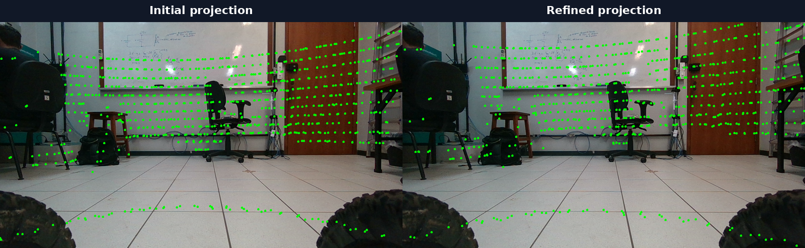
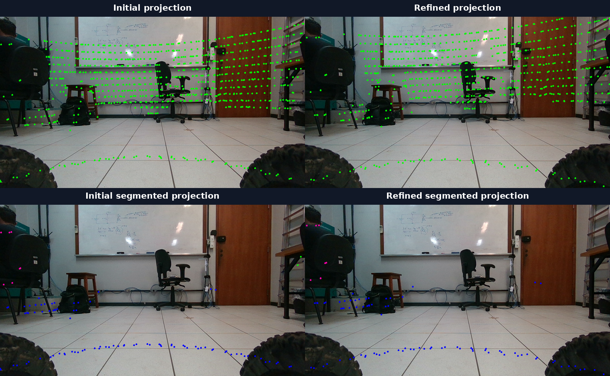

# LiDAR–Camera Calibration for the Espeleo Robot

## Project summary

This project established a repeatable extrinsic-calibration workflow for the
Intel RealSense D435i RGB camera and Velodyne LiDAR mounted on Espeleo. The
objective was to align 3D LiDAR returns with the camera image and then express
the result in the IMU frame required by FAST-LIO2.

The work covered more than optimizer execution: ROS 2 data extraction,
timestamp synchronization, automatic segmentation, third-party C++ build
debugging, transform-convention analysis, and validation against both image
geometry and the physical sensor mounting.

## Inputs

A ROS 2 Jazzy calibration bag provided:

| Stream | Topic | Messages |
|---|---|---:|
| RGB image | `/camera/camera/color/image_raw` | 2,423 |
| Camera intrinsics | `/camera/camera/color/camera_info` | 2,423 |
| Velodyne cloud | `/velodyne_points` | 803 |

The export stage generated 401 synchronized PNG/PCD pairs. Camera intrinsics
came from `sensor_msgs/msg/CameraInfo`, and the Velodyne clouds retained the
`intensity` field required by CalibAnything. SAM2 generated 21,155 masks across
401 per-image mask folders.

## Method

1. Inspected bag topics, types, counts, frame IDs, camera intrinsics, and point
   fields.
2. Exported approximately synchronized images and point clouds with a local
   ROS 2 Python tool.
3. Generated automatic masks with a SAM2.1 Hiera Small model and post-processed
   them for CalibAnything.
4. Built and patched CalibAnything, then configured relative dataset paths,
   camera parameters, search ranges, and a manually supplied initial
   extrinsic.
5. Ran a first successful optimization and a second pass initialized from the
   refined result with denser temporal sampling.
6. Validated initial/refined projections and checked the resulting translation
   against the physical mounting.
7. Defined the frame conversion needed to use the camera-optical result in
   FAST-LIO2.

## Projection result



The comparison shows the initial and refined LiDAR projections over the RGB
frame. Walls, the floor, furniture, and object boundaries provide constraints
at multiple depths.



The segmented views provide a second qualitative check: improvement should
occur at scene boundaries, not only by increasing the number of points visible
in the image.

## Engineering obstacles

### Reliable ROS 2 export

The initial `ros2_unbag` route failed because an OpenCV Python binding could not
convert a `pathlib.PosixPath` passed to `cv2.imwrite`. A local `rosbag2_py`
exporter removed that dependency and made synchronization tolerance, topic
names, output naming, and temporal subsampling explicit.

### Third-party build compatibility

CalibAnything required two small compatibility fixes on the target system:

- OpenCV 4 uses `cv::COLOR_HSV2BGR` rather than the legacy `CV_HSV2BGR`
  macro.
- The build referenced a hardcoded jsoncpp static archive; linking the
  installed shared library resolved the linker failure.

These fixes are captured as reproducible troubleshooting steps rather than
left as undocumented local changes.

### Configuration schema debugging

CalibAnything expected exact keys such as `img_folder`, `pc_folder`,
`mask_folder`, `img_format`, and `pc_format`. Runtime parameters—including
`point_range`—had to be nested under `params` for the tested revision. Missing
or misplaced values caused empty image paths, zero detected clouds, and a
`point_range_top < point_range_bottom` assertion.

### Transform conventions

The bag did not contain `/tf` or `/tf_static`, so an initial transform had to
be supplied manually. A D435i IMU extrinsic from the FAST-LIO2 configuration
could not be used directly because its target frame was the IMU frame, while
CalibAnything projects into `camera_color_optical_frame`.

The successful initial guess included the required optical-axis conversion:
optical `+x` right, `+y` down, and `+z` forward. The final deployment
conversion is:

```text
T_imu_lidar = T_imu_color_optical · T_color_optical_lidar
```

This distinction prevents a projection that looks correct from becoming an
incorrect LiDAR–IMU rotation in FAST-LIO2.

## Result

The project produced:

- a refined LiDAR-to-camera-color-optical calibration workflow;
- repeatable data-export and metadata tools;
- SAM2 mask generation and CalibAnything configuration guidance;
- visual projection evidence for first-pass and refined runs;
- an explicit, testable conversion to FAST-LIO2's LiDAR-to-IMU convention.

The first successful optimization and the denser follow-up both produced
recognizable scene alignment. The follow-up result is treated as a candidate,
not as ground truth: translation can appear plausible in projection while
still exceeding the physical sensor lever arm.

## Deployment status

The camera-optical calibration workflow is usable and reproducible. Final
FAST-LIO2 deployment still requires validating the chosen
`T_imu_color_optical` static transform and the composed `T_imu_lidar` on the
robot. That validation includes gravity/map orientation, ground-plane height,
wall duplication, short-loop consistency, and direct measurement of the
IMU-to-LiDAR translation.

See the [complete calibration guide](../README.md) for commands, example
configuration, scripts, coordinate conventions, and troubleshooting.
